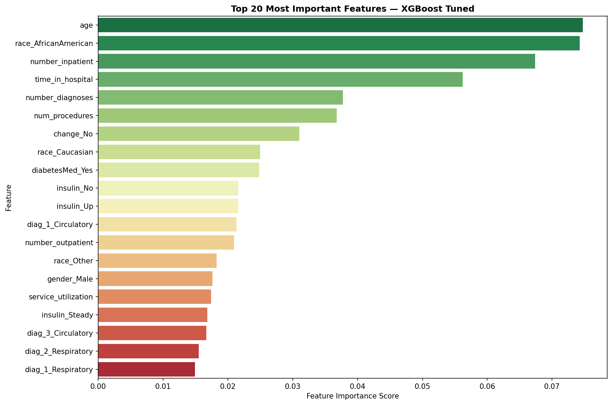

# 🏥 Hospital Readmission Prediction


🔗 **Live App:** https://hospital-readmission-prediciton-arup-roy.streamlit.app


A machine learning system that predicts whether a diabetic patient 
will be readmitted to hospital within 30 days of discharge — 
enabling early intervention and reducing preventable readmissions.

---

## 📋 Table of Contents
- [Project Description](#-project-description)
- [Problem Statement](#-problem-statement)
- [Dataset](#-dataset)
- [Project Structure](#-project-structure)
- [Approach](#-approach)
- [Key Findings](#-key-findings)
- [Model Performance](#-model-performance)
- [Business Recommendations](#-business-recommendations)
- [Known Limitations](#-known-limitations)
- [How to Run](#-how-to-run)

---

## 📌 Project Description

Hospital readmissions within 30 days are a critical quality metric 
for healthcare providers. They represent a significant financial 
burden — costing the US healthcare system billions annually — and 
often indicate gaps in patient care during discharge planning.

This project builds an end-to-end ML pipeline that:
- Ingests and cleans real patient data from 130 US hospitals
- Performs exploratory analysis to identify high-risk patient profiles
- Trains and evaluates multiple classification models
- Deploys a live Streamlit web application for clinical decision support

---

## ❓ Problem Statement

> **Can we predict, at the time of discharge, whether a diabetic 
> patient will be readmitted within 30 days?**

Early identification of high-risk patients allows hospitals to:
- Schedule follow-up calls before discharge
- Arrange home healthcare visits
- Adjust discharge medications
- Reduce 30-day readmission rates and associated penalties

---

## 📊 Dataset

| Property | Detail |
|---|---|
| Source | UCI ML Repository |
| Name | Diabetes 130-US Hospitals (1999-2008) |
| Rows | 101,766 patient encounters |
| Features | 50 original → 81 after preprocessing |
| Target | Binary: Readmitted within 30 days (1) or not (0) |
| Class Balance | 88.8% negative / 11.2% positive |

---

## 📁 Project Structure
```
hospital-readmission-prediction/
│
├── data/
│   ├── raw/                    ← Original unmodified dataset
│   └── processed/              ← Cleaned and transformed data
│
├── notebooks/
│   ├── 01_data_cleaning.ipynb
│   ├── 02_eda.ipynb
│   ├── 03_preprocessing.ipynb
│   └── 04_model_training.ipynb
│
├── models/
│   ├── xgb_tuned_model.pkl     ← Trained XGBoost model
│   ├── scaler.pkl              ← Fitted StandardScaler
│   └── best_threshold.pkl      ← Optimized decision threshold
│
├── reports/                    ← EDA and evaluation charts
├── app.py                      ← Streamlit deployment app
├── requirements.txt
└── README.md
```

---

## 🔬 Approach

### 1. Data Cleaning
- Identified and replaced 7 columns using `?` as missing value disguise
- Dropped 7 columns: ID columns, zero-variance features, 
  and columns with >40% missing values
- Imputed low-missing columns using mode
- Converted 3-class target to binary classification

### 2. Exploratory Data Analysis
- Analyzed class imbalance (88.8% vs 11.2%)
- Identified age and prior hospitalization as key risk factors
- Found insulin adjustment correlates with higher readmission rates
- Examined ICD diagnosis code distributions across 18 medical categories

### 3. Preprocessing
- Grouped 700+ ICD codes into 18 medical categories
- Applied Label Encoding for ordinal features (age)
- Applied One Hot Encoding for nominal features
- Engineered `service_utilization` feature
- Applied SMOTE to balance training data
- Used StandardScaler fitted only on training data

### 4. Model Training
- Benchmarked Logistic Regression, Random Forest, XGBoost
- Optimized decision threshold for maximum Recall
- Applied RandomizedSearchCV for hyperparameter tuning
- Selected XGBoost Tuned as final model

### 5. Deployment
- Built Streamlit web app for clinical decision support
- Accepts patient information as input
- Returns risk classification and probability score

---

## 🔍 Key Findings

### Patient Risk Factors
| Finding | Detail |
|---|---|
| Age | Patients aged 70-90 show consistently high readmission rates (~12%) |
| Prior Hospitalizations | Most important numerical predictor (correlation: 0.17) |
| Insulin Adjustment | Patients with adjusted insulin have 13-14% readmission rate vs 10% for no insulin |
| Primary Diagnosis | Circulatory conditions are most common (29.8% of admissions) |
| Race | Emerged as top feature — warrants bias investigation |

### EDA Charts
| Chart | Insight |
|---|---|
|  | Severe class imbalance requiring SMOTE |
|  | Elderly patients at highest reliable risk |
|  | Prior hospitalizations strongly predict readmission |
|  | Age and race are top model features |

---

## 📈 Model Performance

### Model Comparison (Default Threshold)
| Model | AUC-ROC | Recall | F1 | Precision |
|---|---|---|---|---|
| Logistic Regression | 0.571 | 0.041 | 0.073 | 0.325 |
| Random Forest | 0.634 | 0.026 | 0.049 | 0.361 |
| XGBoost | 0.671 | 0.029 | 0.055 | 0.569 |

### After Threshold Optimization
| Model | Threshold | AUC-ROC | Recall | F1 | Precision |
|---|---|---|---|---|---|
| Logistic Regression | 0.24 | 0.571 | 0.367 | 0.213 | 0.150 |
| Random Forest | 0.23 | 0.634 | 0.408 | 0.252 | 0.183 |
| XGBoost | 0.16 | 0.671 | 0.422 | 0.276 | 0.206 |
| **XGBoost Tuned** ✅ | **0.19** | **0.653** | **0.530** | **0.262** | **0.174** |

### Why Recall is Our Primary Metric
In healthcare, a False Negative (missing a high-risk patient) is 
far more costly than a False Positive (unnecessary follow-up call). 
Our tuned model catches **53% of patients who will be readmitted** 
— a significant improvement over the 3% baseline.

---

## 💼 Business Recommendations

**1. Implement Risk-Based Discharge Protocol**
> Flag patients with readmission probability > 19% for enhanced 
> discharge planning. At 53% recall, the model identifies more than 
> half of all high-risk patients before they leave the hospital.

**2. Prioritize Elderly Patient Follow-up**
> Patients aged 70-90 represent the largest volume of high-risk 
> readmissions. A dedicated post-discharge call program for this 
> group could significantly reduce 30-day readmission rates.

**3. Monitor Insulin-Adjusted Patients**
> Patients whose insulin was adjusted during admission show 13-14% 
> readmission rates. Flag these patients for mandatory pharmacist 
> consultation before discharge.

**4. Investigate Racial Disparities**
> Race emerged as a top-2 predictive feature. This warrants a 
> dedicated equity analysis to determine whether disparities reflect 
> genuine clinical differences or systemic healthcare access issues.

**5. Track Prior Hospitalizations**
> Number of prior inpatient visits is the strongest numerical 
> predictor. Patients with 2+ prior inpatient visits in the past 
> year should be automatically enrolled in a high-risk monitoring 
> program.

---

## ⚠️ Known Limitations

| Limitation | Detail |
|---|---|
| SMOTE CV Leakage | SMOTE was applied before cross-validation, inflating CV scores. Production deployment should use imblearn Pipeline |
| Model Recall | 53% recall means 47% of high-risk patients are still missed |
| Temporal Validity | Data is from 1999-2008. Healthcare practices have changed significantly |
| Demographic Bias | Race as a top feature requires careful bias auditing before clinical use |
| Threshold Sensitivity | Performance metrics are highly sensitive to the chosen threshold |

---

## 🚀 How to Run

### 1. Clone the Repository
```bash
git clone https://github.com/analyst-ted/hospital-readmission-prediction.git
cd hospital-readmission-prediction

> **Note:** Raw and processed data files are not included in this 
> repository due to size constraints. Download the dataset from 
> [UCI ML Repository](https://archive.ics.uci.edu/dataset/296/diabetes+130-us+hospitals+for+years+1999-2008) 
> and place it in `data/raw/` before running the notebooks.
```

### 2. Create Virtual Environment
```bash
python -m venv venv
source venv/bin/activate        # Mac/Linux
venv\Scripts\activate           # Windows
```

### 3. Install Dependencies
```bash
pip install -r requirements.txt
```

### 4. Run the App
```bash
streamlit run app.py
```

### 5. Run Notebooks
Open notebooks in order:
```
01_data_cleaning.ipynb
02_eda.ipynb
03_preprocessing.ipynb
04_model_training.ipynb
```

---

## 🛠️ Tech Stack

| Tool | Purpose |
|---|---|
| Python 3.13 | Core language |
| Pandas & NumPy | Data manipulation |
| Matplotlib & Seaborn | Visualization |
| Scikit-learn | ML pipeline |
| XGBoost | Final model |
| Imbalanced-learn | SMOTE |
| Streamlit | Deployment |
| Joblib | Model serialization |
| Git & GitHub | Version control |

---

*This project is for educational and research purposes only. 
Not intended for clinical use without proper medical validation.*
